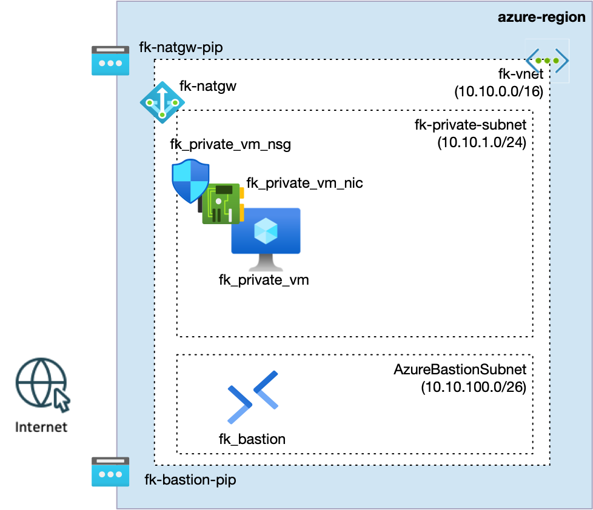
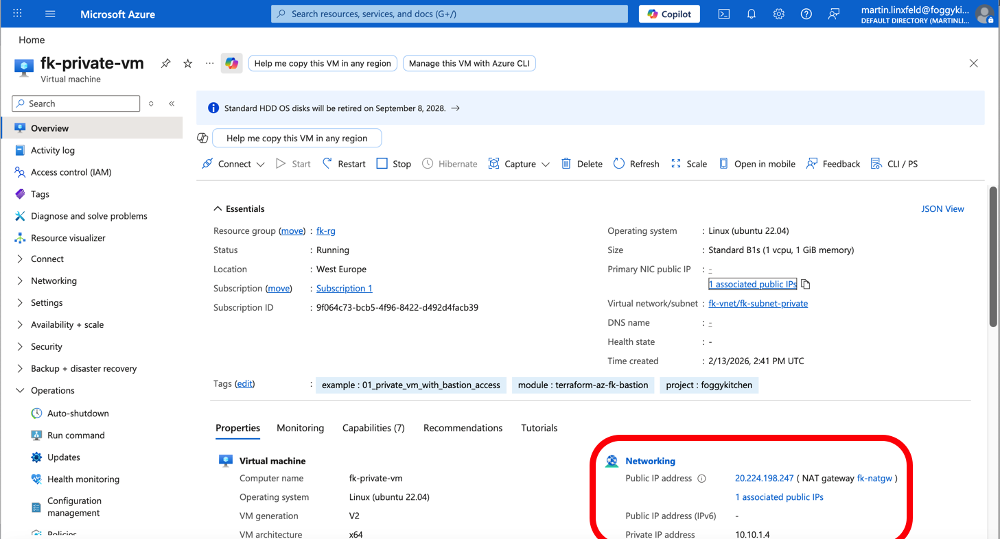
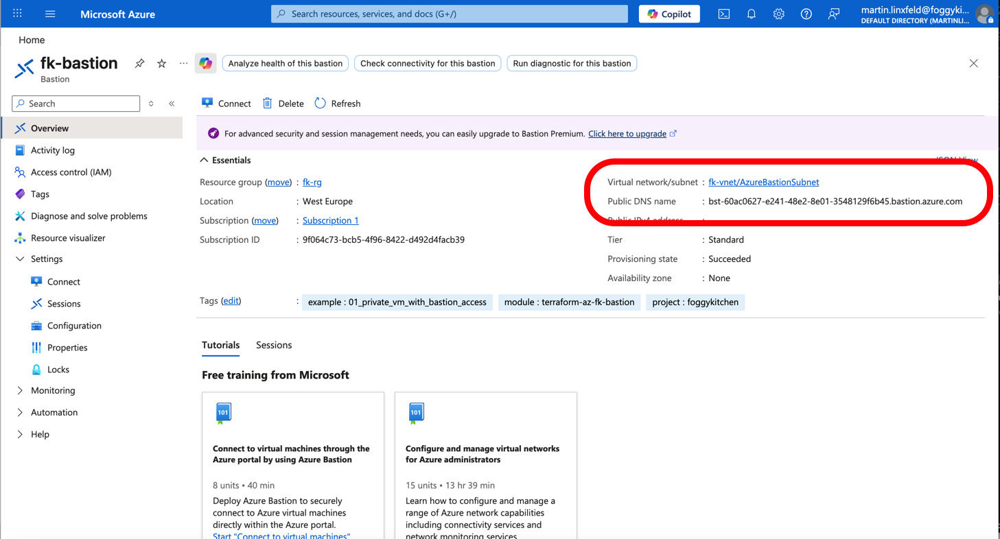

# Example 01: Private VM with Azure Bastion Access (NIC-level NSG + NAT Gateway)

In this example, we deploy a **private Linux Virtual Machine** protected
by a **NIC-level Network Security Group**, with **operator access
provided exclusively via Azure Bastion** and **outbound egress handled by NAT Gateway**.

This is a deliberate step forward from basic compute examples: the VM
has **no public IP**, and all access is controlled explicitly through
networking and security policies.

---

## 🧭 Architecture Overview

This deployment assumes that a Virtual Network already exists
(e.g. created using the `terraform-az-fk-vnet` module).

The Virtual Network contains: 
- a **private subnet** for the workload, 
- a dedicated **AzureBastionSubnet** for secure operator access.

The VM is deployed into the **private subnet** and protected by an **NSG
attached directly to its network interface (NIC)**.



*Figure 2. Architecture overview of a private VM protected by a NIC-level NSG and accessed via Azure Bastion.*

This example creates: 
- A **Virtual Network** with subnets (via `terraform-az-fk-vnet`)
- A single **private Linux Virtual Machine** (via `terraform-az-fk-compute`)
- A dedicated **Network Interface (NIC)** (via `terraform-az-fk-compute`)
- A **NIC-level Network Security Group** (via `terraform-az-fk-nsg`)
- An **Azure Bastion Host** (Standard) via `terraform-az-fk-bastion`
- A **NAT Gateway** (via `terraform-az-fk-natgw`) for outbound internet access
- No public IPs on the VM/NIC (egress and access are via NAT Gateway and Bastion)
- No Load Balancer 
- No autoscaling

This is still a **foundation example**, but now focused on **secure
access patterns**.

---

## 🎯 Why this example exists

In real Azure platforms: 
- public IPs are **not** a default, 
- operator access must be **explicit and auditable**, 
- security boundaries must be **clearly scoped**.

This example exists to demonstrate:

-  the difference between **subnet-level** and **NIC-level** NSGs,
-  how to apply **workload-specific security policies**,
-  how Azure Bastion enables **secure, private VM access** without exposing infrastructure to the Internet.

This example intentionally avoids: 
- jumpbox VMs, 
- public SSH access, 
- broad inbound rules.

---

## 🔐 Security Model

-   The VM has **no public IP address**
-   The NSG is attached **directly to the VM NIC**
-   Inbound SSH (TCP/22) is allowed **only from `AzureBastionSubnet`**
-   All other inbound traffic is denied by default

This creates a **tight, workload-scoped security boundary**.

---

## 🚀 Deployment Steps

``` bash
tofu init
tofu plan
tofu apply
```

---

## 🧪 Test: Private Access via Azure Bastion (CLI)

This example uses **Azure Bastion native tunneling** for SSH access.

### 1) Export the SSH private key

``` bash
tofu output -raw ssh_private_key_pem > id_rsa
chmod 600 id_rsa
```

### 2) Open the Bastion tunnel (keep this terminal running)

``` bash
az network bastion tunnel \
  --name fk-bastion \
  --resource-group fk-rg \
  --target-resource-id $(az vm show \
    -g fk-rg \
    -n fk-private-vm \
    --query id -o tsv) \
  --resource-port 22 \
  --port 50023
```

You should see:

    Opening tunnel on port: 50023
    Tunnel is ready, connect on port 50023

### 3) Connect using SSH from a second terminal

``` bash
ssh -i id_rsa -p 50023 azureuser@127.0.0.1
```

Expected result: 
- successful SSH login, 
- private IP address shown (e.g. `10.10.1.4`), 
- no public exposure.

---

## 🖼️ Azure Portal View

### Private VM (no public IP)



*Figure 4. Private Linux Virtual Machine deployed without a public IP (only NATGW Public IP).*

### Azure Bastion



*Figure 5. Azure Bastion deployed into a dedicated AzureBastionSubnet.*

---

## 🧹 Cleanup

``` bash
tofu destroy
```

---

## 🪪 License

Licensed under the **Universal Permissive License (UPL), Version 1.0**.
