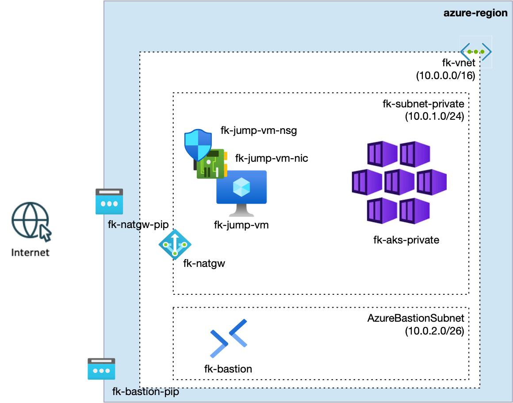

# Example 02: Private AKS with Bastion Access (Jump VM + NATGW)

In this example, we deploy a **private AKS cluster** and provide **operator access**
through **Azure Bastion** and a **private jump VM**, while **outbound egress**
is handled by **NAT Gateway**.

This is a secure-by-default pattern:
- AKS API is private,
- the jump VM has **no public IP**,
- ingress/egress are explicit and auditable.

---

## 🧭 Architecture Overview

This example uses the following modules:

- **VNet + subnets** via `terraform-az-fk-vnet`
- **Bastion** via `terraform-az-fk-bastion`
- **NAT Gateway** via `terraform-az-fk-natgw`
- **NIC-level NSG** via `terraform-az-fk-nsg`
- **Jump VM** via `terraform-az-fk-compute`
- **AKS (private cluster)** via `terraform-az-fk-aks`

Key subnets:
- `fk-subnet-private` for AKS + jump VM
- `AzureBastionSubnet` for Bastion



---

## 🚀 Deployment Steps

From the example directory:

```bash
tofu init
tofu plan
tofu apply
```

---

## 🔐 Access Flow

1. **Open a Bastion tunnel** to the jump VM:

```bash
az network bastion tunnel \
  --name fk-bastion \
  --resource-group fk-rg \
  --target-resource-id $(az vm show -g fk-rg -n fk-jump-vm --query id -o tsv) \
  --resource-port 22 \
  --port 50025
```
2. Export the SSH private key

``` bash
tofu output -raw jump_private_key_openssh > id_rsa
chmod 600 id_rsa
```

3. **SSH to the jump VM** through the tunnel:

```bash
ssh -i id_rsa -p 50025 azureuser@127.0.0.1
```

4. **Use kubectl from the jump VM** to access the private AKS:

```bash
az aks get-credentials -g fk-rg -n fk-aks-private --admin
kubectl get nodes
```

---

## 🧹 Cleanup

```bash
tofu destroy
```

---

## 🪪 License

Licensed under the **Universal Permissive License (UPL), Version 1.0**.
